<p align="center" width="100%">
    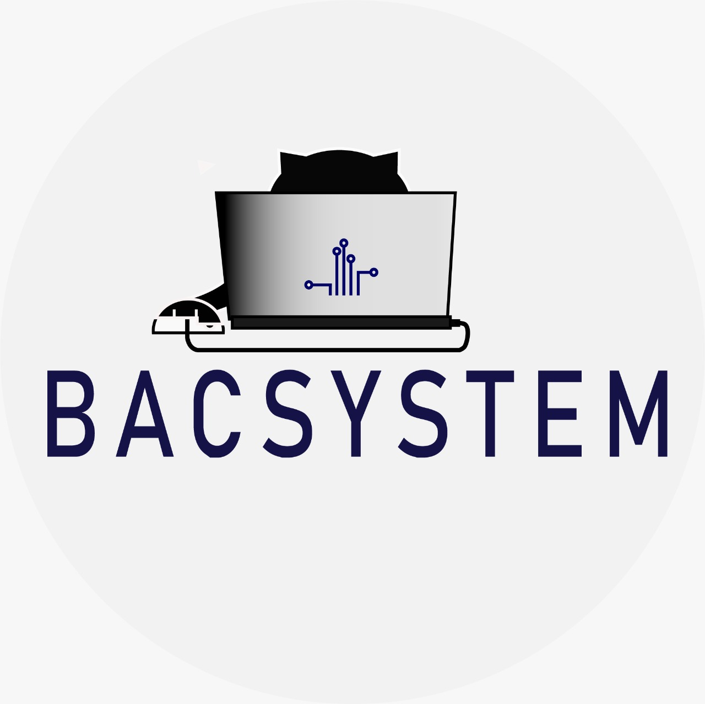
</p>

# PROGRAMACIÓN JAVA

## CONTENIDO TEMÁTICO

### [1. Lenguaje de programación Java](#Lenguaje-de-programación-Java)

- [Lenguaje Java](#Lenguaje-java)
- [JDK y JRE](#JDK-y-JRE)
- [Archivos de instalación](#Archivos-de-instalación)
- [Variables de entorno](#Variables-de-entorno)
- [IDE Java](#IDE-Java)
- [Herramientas de construcción de proyectos](#Herramientas-de-construcción-de-proyectos)
- [Archivos JAR, WAR y EAR](#Archivos-JAR-WAR-y-EAR)

## CONTENIDO TEMÁTICO

### Lenguaje de programación Java

### Lenguaje java

**Java** es un lenguaje de programación y plataforma informática creado y vendido por Sun Microsystems en 1995.

Es un **lenguaje orientado a objetos** que tiene como objetivo permitir a los desarrolladores de aplicaciones escribir
un programa una vez y ejecutarlo en cualquier dispositivo.

**Java** es un lenguaje de programación ampliamente utilizado para codificar aplicaciones web. Ha sido una opción
popular entre los desarrolladores durante más de dos décadas, con millones de aplicaciones Java en uso en la actualidad.
Java es un lenguaje multiplataforma, orientado a objetos y centrado en la red que se puede utilizar como una plataforma
en sí mismo. Es un lenguaje de programación rápido, seguro y confiable para codificarlo todo, desde aplicaciones móviles
y software empresarial hasta aplicaciones de macrodatos y tecnologías del servidor.

**¿Para qué se utiliza el lenguaje de programación Java?**

1. [x] Desarrollo de videojuegos
2. [x] Computación en la nube
3. [x] Macrodatos
4. [x] Inteligencia artificial
5. [x] Internet de las cosas
6. [x] Aplicaciones móviles
7. [x] Aplicaciones web
8. [x] Software empresarial
9. [x] Aplicaciones de escritorio
10. [x] Apps para Android

**¿Cómo funciona Java?**

El **código** Java se escribe por primera vez en el kit de desarrollo de Java, que está disponible para Windows, Linux y
macOS.

Los **lenguajes informáticos de alto nivel** son más fáciles de leer, escribir y depurar, pero debe haber un compilador
entre el lenguaje de programación y la máquina informática para compilar o interpretar el código de modo que pueda
ejecutarse en un lenguaje que la computadora pueda entender.

**Java** es un lenguaje portátil que puede ejecutarse en cualquier sistema operativo. El código de programa escrito en
Java se compila en un formato especial llamado código de bytes y luego se ejecuta en la máquina virtual Java (JVM). Esto
significa que el código Java se puede ejecutar en cualquier plataforma con una JVM instalada, lo que lo hace
independiente del sistema operativo. Un programa Java consta de uno o más archivos de código fuente con la extensión
`.java` que contienen instrucciones escritas en el lenguaje Java.

Estos archivos se compilan utilizando el compilador javac, que produce archivos con una extensión `.class` que
contienen código de bytes. Estos archivos de código de bytes se pueden ejecutar en cualquier plataforma donde esté
instalada la JVM.

Java también proporciona una gran cantidad de bibliotecas estándar para funciones comunes como procesamiento de
entrada/salida, redes y desarrollo de interfaz gráfica de usuario. Estas bibliotecas están disponibles para todos los
programas Java y se incluyen automáticamente cuando el programa se compila y ejecuta.

**En resumen**, Java es un lenguaje de programación que se compila en código de bytes y se ejecuta en una máquina
virtual, lo que permite que el código del programa se ejecute en cualquier plataforma donde esté instalada la JVM y
proporciona una gran cantidad de bibliotecas estándar para facilitar el desarrollo de aplicaciones.

`Diagrama`:

<p align="center" width="100%">
    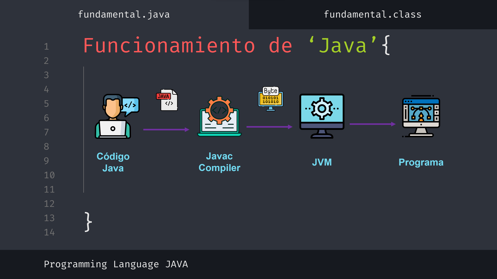
</p>

**¿Cuáles son las características principales de Java?**

Algunas de las características principales de la plataforma y el lenguaje de programación Java son:

1. [x] **_Orientado a objetos_**: es un lenguaje orientado a objetos, lo que significa que se basa en los conceptos de
   objetos
   y categorías para organizar y estructurar el código.
2. [x] **_Multiplataforma_**: es independiente de la plataforma, lo que significa que el código Java se puede ejecutar
   en
   cualquier sistema operativo o dispositivo compatible con Java sin necesidad de recompilar el código.
3. [x] **_Seguridad_**: las funciones de seguridad integradas ayudan a proteger su sistema de amenazas externas.
4. [x] **_Gestión automática de la memoria_**: libera automáticamente la memoria utilizada por los objetos que ya no
   están en
   uso.
5. [x] **_Subprocesos múltiples_**: permite que varios subprocesos se ejecuten en paralelo, lo que permite que las
   aplicaciones realicen múltiples tareas simultáneamente.
6. [x] **_API integrada_**: Tiene una gran cantidad de API (interfaces de programación de aplicaciones) integradas que
   permiten a los desarrolladores utilizar diversas funciones y herramientas para crear aplicaciones.
7. [x] **_Popularidad_**: Es uno de los lenguajes de programación más populares y utilizados en el mundo. Se utiliza
   principalmente para el desarrollo de aplicaciones empresariales y el desarrollo de aplicaciones de Android.

### JDK-y-JRE

#### Java Runtime Environment - JRE

Java Runtime Environment (JRE) es el software necesario para que los programas Java se ejecuten correctamente. Java es
el lenguaje informático en el que se basan muchas aplicaciones web y móviles modernas. JRE es la tecnología subyacente
para que los programas Java se comuniquen con los sistemas operativos. Actúa como traductor y habilitador y proporciona
todos los recursos para que una vez escrito el software Java pueda ejecutarse en cualquier sistema operativo sin mayores
modificaciones.

**¿Por qué es importante el JRE?**

Los programas de software requieren un entorno de ejecución que proporcione acceso a la memoria y otros recursos del
sistema, como archivos de programa y dependencias. En el pasado, la mayoría del software utilizaba el sistema operativo
directamente como entorno operativo. Sin embargo, esto significa que los desarrolladores tienen que escribir código
diferente para cada sistema operativo en el que quieran que se ejecute su aplicación. La tecnología Java Runtime
Environment (JRE) fue creada para resolver este problema.

**Java Runtime Environment (JRE)** es en realidad uno de los tres componentes de la plataforma Java que cualquier
programa
Java necesita para ejecutarse correctamente. El kit de desarrollo de Java (JDK) y la máquina virtual de Java (JVM) son
los otros dos componentes.

#### Java Development Kit - JDK

**El Java Development Kit (JDK)** es una colección de herramientas de software que se pueden utilizar para desarrollar
aplicaciones Java. Puede configurar el JDK en su entorno de desarrollo descargándolo e instalándolo. Seleccione la
versión del software JDK que corresponda a la versión de Java que desea utilizar. Por ejemplo, Java Standard Edition o
Java SE requiere el kit de desarrollo Java (JDK) de Java SE.

#### Máquina virtual de Java - JVM

**La JVM** es el software que ejecuta programas Java línea por línea. Los desarrolladores configuran los ajustes de JVM
para administrar los recursos de la aplicación cuando se inicia una aplicación Java. Por ejemplo, puede configurar los
ajustes de memoria JVM y controlar cuánta memoria interna utiliza una aplicación Java mientras se está ejecutando.

**Rol del JRE en el lenguaje de programación Java**

**Java Runtime Environment (JRE)** combina el código Java existente. Para hacer esto, utiliza el kit de desarrollo de
Java
(JDK) y un código integrado adicional llamado bibliotecas. Luego crea una instancia JVM o una copia local para
finalmente ejecutar el programa Java. Las JVM están disponibles para diferentes sistemas operativos y el JRE crea una
única copia del código Java que se puede ejecutar en todo tipo de JVM. De esta forma, el JRE contribuye a la
independencia de plataforma de las aplicaciones Java. Se pueden escribir una vez y ejecutar en cualquier lugar.

**Diferencias entre el JRE, la JVM y el JDK**

**El Java Development Kit (JDK)** es una capa de software sobre Java Runtime Environment (JRE) que contiene
compiladores,
depuradores y otras herramientas comunes a cualquier entorno de desarrollo de software. El código escrito en JDK tiene
una sintaxis similar al inglés. El JDK lo compila y transfiere el código de bytes al JRE. Por el contrario, JRE
contiene bibliotecas de clases y archivos de soporte JVM. Utilice estos componentes de software para ejecutar código
intermedio en cualquier dispositivo.

`Diagrama`:

<p align="center" width="100%">
    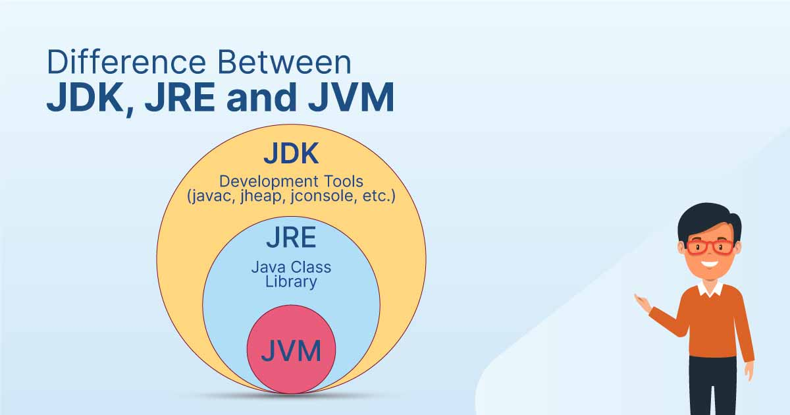
</p>

```link
https://www.shiksha.com/online-courses/articles/difference-between-jdk-jre-and-jvm/
```

### Archivos de instalación

1. [x] [Instalación del OpenJDK](https://jdk.java.net/)

**Pasos de instalación:**

`Image 1`:

<p align="center" width="100%">
    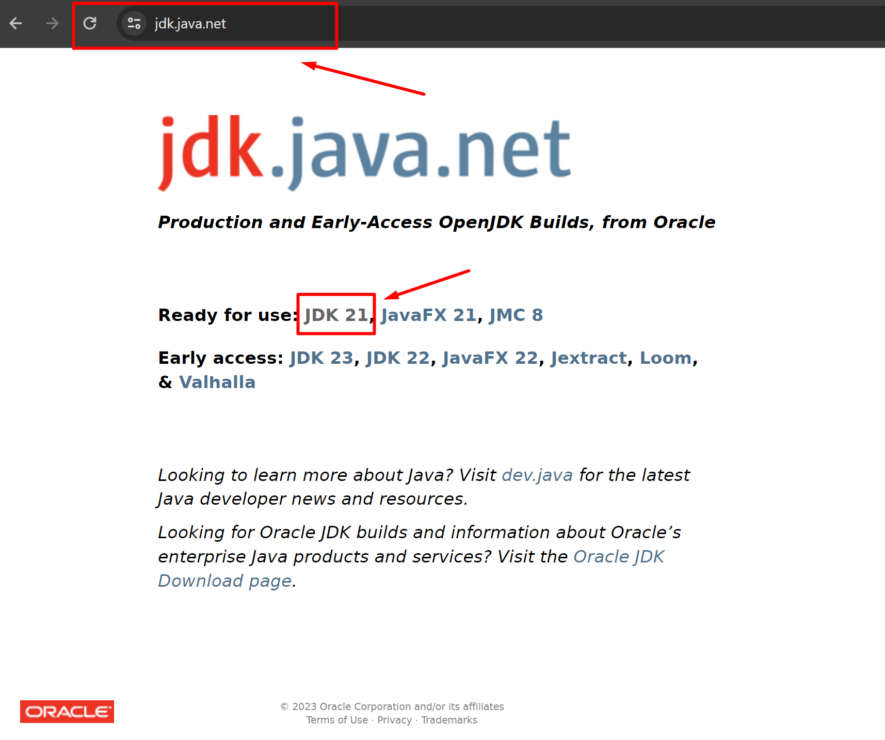
</p>

`Image 2`:

<p align="center" width="100%">
    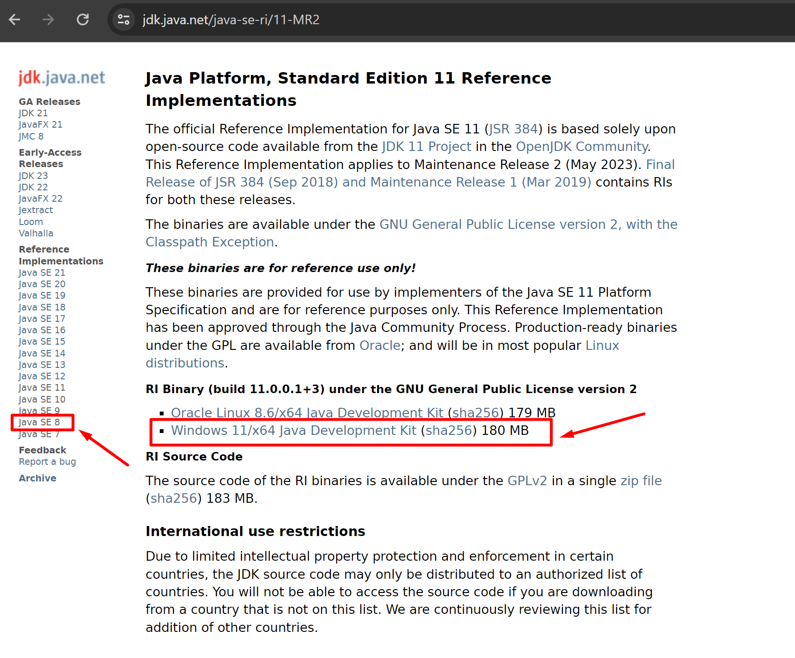
</p>

`Image 3`:

<p align="center" width="100%">
    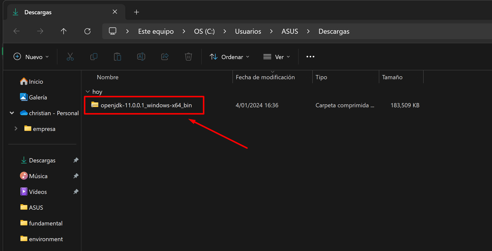
</p>

Una vez descargado el archivo JDK, extraemos el contenido y encontraremos los siguientes archivos:

`Image 4`:

<p align="center" width="100%">
    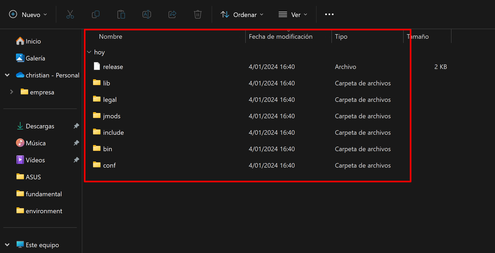
</p>

### Variables de entorno

**Pasos de instalación y configuración de las variables de entorno:**

Para la configuración de las variables de entorno seguiremos los siguientes pasos:

`Image 1`:

<p align="center" width="100%">
    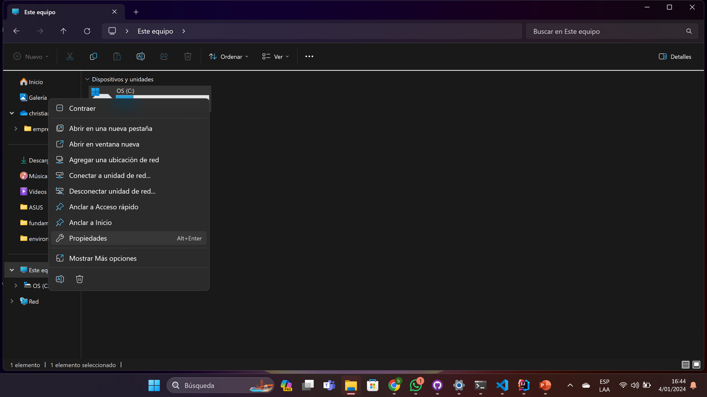
</p>

`Image 2`:

<p align="center" width="100%">
    
</p>

`Image 3`:

<p align="center" width="100%">
    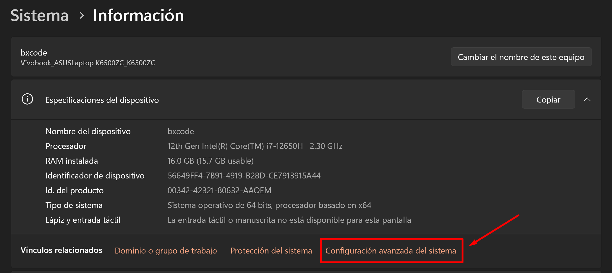
</p>

`Image 4`:

<p align="center" width="100%">
    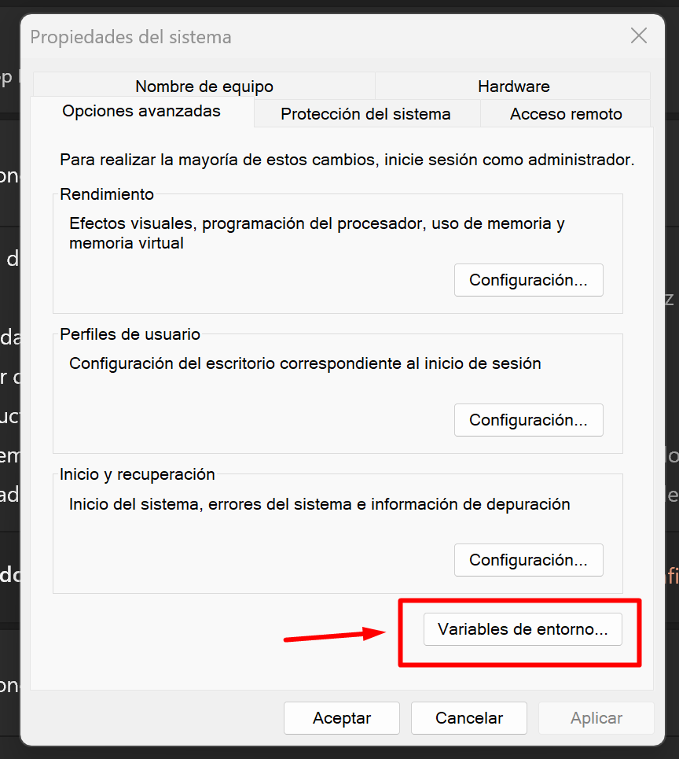
</p>

`Image 5`:

<p align="center" width="100%">
    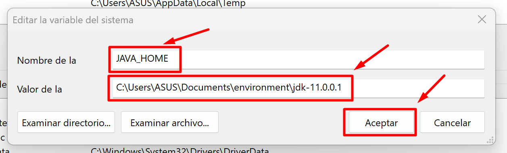
</p>

`Image 6`:

<p align="center" width="100%">
    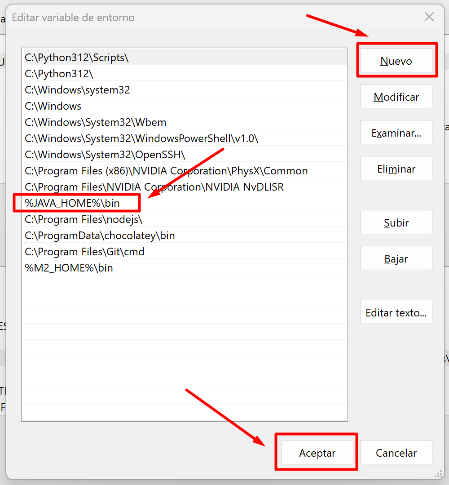
</p>

### Archivos JAR, WAR y EAR

`Image 6`:

<p align="center" width="100%">
    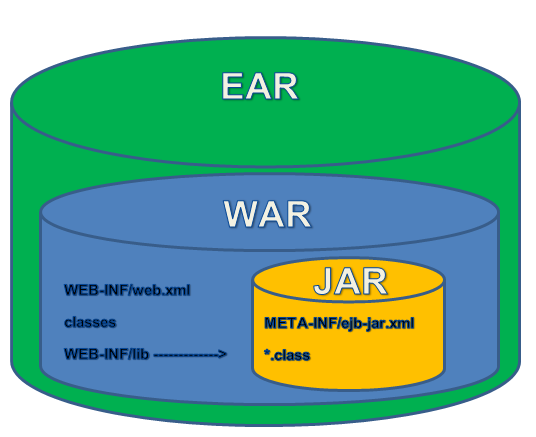
</p>

### IDE Java

<p align="center" width="100%">
    
</p>


<p align="center" width="100%">
    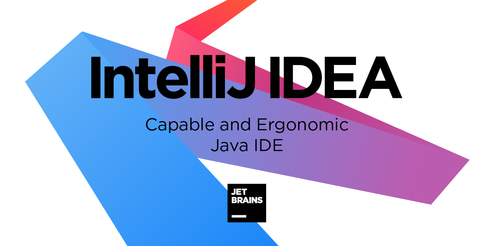
</p>


<p align="center" width="100%" >
    
</p>

### Herramientas de construcción de proyectos

<p align="center" width="100%" >
    
</p>

````
https://maven.apache.org/what-is-maven.html
````

### 2. Estructura básica de Java

1. [ ] Estructura de una clase
2. [ ] Tipo de datos primitivos
3. [ ] Clases Wrapper
4. [ ] Variables
5. [ ] Operadores
6. [ ] Métodos
7. [ ] Método main
8. [ ] Consola
9. [ ] String, StringBuilder y StringBuffer
10. [ ] Comentarios de línea, bloque y documentación
11. [ ] Depuración

### 3. Instrucciones repetitivas y Condicionales

1. [ ] condicionales
2. [ ] Instrucciones condicionales
3. [ ] Instrucciones repetitivas
4. [ ] Instrucciones de transferencia

### 4. Programación orientada a objetos

1. [ ] Clases
2. [ ] Objetos
3. [ ] Constructores
4. [ ] Principios básicos de la POO
5. [ ] Encapsulamiento
6. [ ] Modificadores de acceso
7. [ ] Herencia
8. [ ] Interfaces y clases abstractas
9. [ ] Polimorfismo

### 5. Conceptos generales en Java

1. [ ] Excepciones
2. [ ] Constantes y enumeraciones
3. [ ] La clase Class
4. [ ] Caste de objetos
5. [ ] Directiva static
6. [ ] Operador Lambda
7. [ ] Genéricos Garbage Collector

### 6. Arreglos y colecciones

1. [ ] Arreglos
2. [ ] Colecciones
3. [ ] Streams

### 7. Hilos y concurrencia

1. [ ] Hilos
2. [ ] Clase Thread
3. [ ] Sincronización de métodos

### 8. Archivos y serialización

1. [ ] Archivos
2. [ ] Interface serializable.
3. [ ] NIO.2.
4. [ ] XML
5. [ ] JSON
6. [ ] Comparativa XML vs JSON
7. [ ] Trabajar con JSON

### 9. Hilos y concurrencia

1. [ ] Hilos
2. [ ] Clase Thread
3. [ ] Sincronización de métodos

### 10. Archivos y serialización

1. [ ] Archivos
2. [ ] Interface serializable
3. [ ] NIO.2
4. [ ] XML
5. [ ] JSON
6. [ ] Comparativa XML vs JSON
7. [ ] Trabajar con JSON

### 11. Java Database Connectivity (JDBC)

1. [ ] Creación de base de datos, tablas y relaciones
2. [ ] Consultas
3. [ ] Inserción, eliminación y actualización
4. [ ] Conectividad con Java
5. [ ] El paquete JAVA.SQL
6. [ ] Metadatos

### 12. Pruebas unitarias

1. [ ] Pruebas unitarias
2. [ ] Tipos de pruebas
3. [ ] JUnit
4. [ ] Mockito

### 13. Otras características útiles

1. [ ] Modularidad (jigsaw)
2. [ ] Declaración de variables con “var”
3. [ ] Nuevas funcionalidades de String
4. [ ] Logging

## License

[MIT](../../LICENSE)

https://www.freecodecamp.org/espanol/news/tutorial-jvm-la-arquitectura-de-la-maquina-virtual-de-java-explicada-para-principiantes/