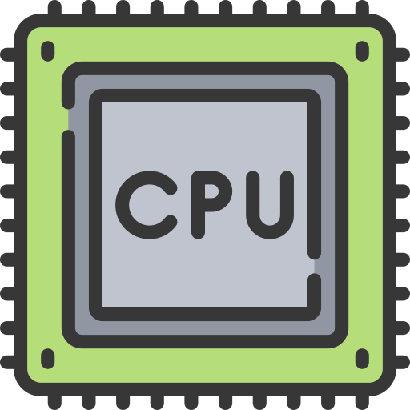

    

# PROGRAMACIÓN JAVA

## CONTENIDO TEMÁTICO

### [1. Lenguaje de programación Java](#Lenguaje-de-programación-Java)

- [Lenguaje Java](#Lenguaje-java)
- Java Developer Kit (JDK) y JRE
- Archivos de instalación
- Archivos JAR, WAR y EAR
- Variables de entorno
- IDE Java
- Herramientas de construcción de proyectos

### 2. Estructura básica de Java

- Programas fuentes y compilados [color]
- Estructura de una clase
- Variables
- Tipo de datos primitivos
- Operadores
- Métodos
- Método main
- Consola
- Clases Wrapper
- String, StringBuilder y StringBuffer
- Comentarios de línea, bloque y documentación
- Depuración

### 3. Instrucciones repetitivas y

- condicionales
- Instrucciones condicionales
- Instrucciones repetitivas
- Instrucciones de transferencia

### 4. Programación orientada a objetos

- Clases
- Objetos
- Constructores
- Principios básicos de la POO
- Encapsulamiento
- Modificadores de acceso
- Herencia
- Interfaces y clases abstractas
- Polimorfismo

### 5. Conceptos generales en Java

- Excepciones
- Constantes y enumeraciones
- La clase Class
- Caste de objetos
- Directiva static
- Operador Lambda
- Genéricos Garbage Collector

### 6. Arreglos y colecciones

- Arreglos
- Colecciones
- Streams

### 7. Hilos y concurrencia

- Hilos
- Clase Thread
- Sincronización de métodos

### 8. Archivos y serialización

- Archivos
- Interface serializable.
- NIO.2.
- XML }
- JSON
- Comparativa XML vs JSON
- Trabajar con JSON

### 9. Hilos y concurrencia

- Hilos
- Clase Thread
- Sincronización de métodos

### 10. Archivos y serialización

- Archivos
- Interface serializable
- NIO.2
- XML
- JSON
- Comparativa XML vs JSON
- Trabajar con JSON

### 11. Java Database Connectivity (JDBC)

- Creación de base de datos, tablas y relaciones
- Consultas
- Inserción, eliminación y actualización
- Conectividad con Java
- El paquete JAVA.SQL
- Metadatos

### 12. Pruebas unitarias

- Pruebas unitarias
- Tipos de pruebas
- JUnit
- Mockito

### 13. Otras características útiles

- Modularidad (jigsaw)
- Declaración de variables con “var”
- Nuevas funcionalidades de String
- Logging

# CONTENIDO TEMÁTICO

### Lenguaje de programación Java

### Lenguaje java

**Java** es un lenguaje de programación y plataforma informática creado y vendido por Sun Microsystems en 1995.

Es un **lenguaje orientado a objetos** que tiene como objetivo permitir a los desarrolladores de aplicaciones escribir
un programa una vez y ejecutarlo en cualquier dispositivo.

**Java** es un lenguaje de programación ampliamente utilizado para codificar aplicaciones web. Ha sido una opción
popular entre los desarrolladores durante más de dos décadas, con millones de aplicaciones Java en uso en la actualidad.
Java es un lenguaje multiplataforma, orientado a objetos y centrado en la red que se puede utilizar como una plataforma
en sí mismo. Es un lenguaje de programación rápido, seguro y confiable para codificarlo todo, desde aplicaciones móviles
y software empresarial hasta aplicaciones de macrodatos y tecnologías del servidor.

**¿Para qué se utiliza el lenguaje de programación Java?**

1. [x] Desarrollo de videojuegos
2. [x] Computación en la nube
3. [x] Macrodatos
4. [x] Inteligencia artificial
5. [x] Internet de las cosas
6. [x] Aplicaciones móviles
7. [x] Aplicaciones web
8. [x] Software empresarial
9. [x] Aplicaciones de escritorio
10. [x] Apps para Android

**¿Cómo funciona Java?**

El **código** Java se escribe por primera vez en el kit de desarrollo de Java, que está disponible para Windows, Linux y
macOS.
Los programadores escriben en el lenguaje de programación Java y el kit lo traduce a un código de computadora que puede
leerse en cualquier dispositivo con el software adecuado.
Esto se logra usando un programa llamado compilador. Los compiladores toman código informático de alto nivel (como Java)
y lo traducen a un lenguaje (llamado código de bytes) que comprenda el sistema operativo.

Luego, un intérprete llamado Máquina Virtual Java (JVM) procesa el código de bytes. JMV funciona en la mayoría de las
plataformas de software y hardware, lo que le permite transferir código Java de un dispositivo a otro. Para ejecutar
Java, la JVM carga el código, lo verifica y proporciona el entorno de ejecución.

`Diagrama`:

    

## Screenshots

## License

[MIT](../../LICENSE)

https://www.freecodecamp.org/espanol/news/tutorial-jvm-la-arquitectura-de-la-maquina-virtual-de-java-explicada-para-principiantes/